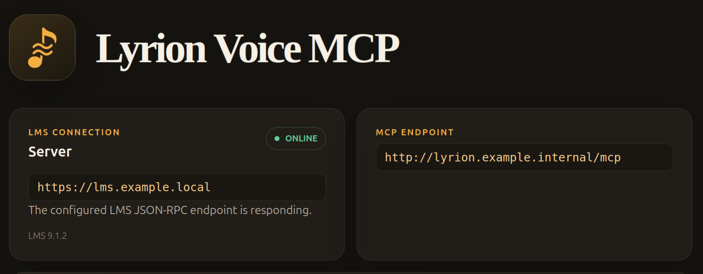

# Lyrion Voice MCP

Lyrion Voice MCP is an MCP server for Lyrion Music Server (LMS). It maintains a local catalogue and search index for phonetic and fuzzy matching, helping voice agents resolve artist and track names that have been transcribed poorly. It's mainly been tested with Home Assistants voice assistant.  Although it's named 'voice' it should work equally well for text interfaces, where I think its search result structure will be more helpful to agents than LMS' raw structure.

It provides more structured search results than LMS itself to help an agent reach the result you want with fewer calls and tokens.



Example requests it aims to let an agent action quickly:

- "Play 90s pop."
- "Play the live album by [artist], I can't remember the title."
- "Append top-rated [artist] tracks to the current queue."
- "Play the original album version of the live track currently playing."

Most of these should only need a couple of tool calls.

The LMS library must be imported and indexed before searching. A catalogue import can be started from the web UI; automatic refresh scheduling is available but disabled by default.

The web frontend includes search-observation and MCP-call logs to help diagnose unexpected behaviour.

> [!WARNING]
> The application has no authentication. It is not suitable for internet use.

## System Prompt and advice for use with Home Assistant
While constantly evolving I use a prompt similar to this:
```
Use the Lyrion voice mcp when asked to play music or media. 
Search will perform a 'fuzzy' search that will account for any problems with voice to text. 
Try to judge from the combination of how the user phrased the request if an album or enqueuing a selection of tracks most fulfills their request. 
Avoid enqueuing continuous tracks from one album unless intentionally playing an album. If asked for an artist or tracks from an artist you should select 15 tracks from a variety of ratings and albums by that artist.
You should use the music player that is in the same area that YOU are in (your area is stated further down these instruction). Unless the user specifically name's a different player, in which case use that one.
Area "Office use player "Office Squeeze".
Area "Kitchen" use player "Downstairs".
Area "Living Room" use player "Downstairs".
Other players are: "Transporter" and "Kitchen Radio".
```
I don't expose the media players directly to HA Voice Assistant to avoid confusion, hence instructions about areas.
I augment this with some automations that will turn on amps / speakers when players become active - Lyrion-voice-mcp will automatically turn on the player itself.

## Container

Save the following as `compose.yml`, replacing the LMS settings for your installation:

```yaml
services:
  lyrion-voice-mcp:
    image: dozigden/lyrion-voice-mcp:0.1.0
    ports:
      - "5600:5600"
    environment:
      LyrionVoiceMcpLms__ServerId: "primary"
      LyrionVoiceMcpLms__BaseUrl: "http://lms-hostname-or-address:9000"
    volumes:
      - application-data:/data
    restart: unless-stopped

volumes:
  application-data:
```

Start the application in the background:

```sh
docker compose up -d
```

The image serves the complete application on port `5600` and supports `linux/amd64` and `linux/arm64`. Compose persists the application database and search-index artifacts under `/data` in the `application-data` named volume.

## Development

### Requirements

- .NET SDK 10.0.302 or a compatible 10.0 patch
- Node.js 24
- Docker 29 or later for container validation

### Running locally

Install frontend dependencies once:

```sh
cd LyrionVoiceMcp.Web
npm ci
```

From the repository root, run `./dev.sh` and press `A` to start the API and Vite. The API listens on `5600` and Vite on `5175`. `./dev-startall.sh` provides an unattended equivalent; PowerShell variants are included.

The launchers load ignored machine-local LMS settings from `.data/dev/appsettings.local.json`:

```json
{
  "LyrionVoiceMcpLms": {
    "ServerId": "development",
    "BaseUrl": "http://lms-hostname-or-address:9000",
    "RequestTimeoutSeconds": 5
  }
}
```

### Validation

```sh
./scripts/test-fast.sh
./scripts/test-full.sh
```

The fast script selects affected lanes when Git history is available. The full script restores, builds, tests backend and frontend projects, and runs repository checks.

## Licence

Lyrion Voice MCP is released under the [MIT licence](LICENSE).

Third-party licence notices are available from the application's `/licences` page.
